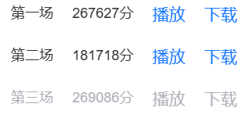
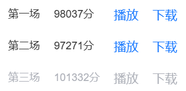

# CodeCraft2024 / 2024华为软件精英挑战赛
我们是来自西南赛区的CQU-42IsAllYouNeed（[刘怡鹏](https://github.com/MineQihang)，[蒋佳宏](https://github.com/jiuwen236)）。

本仓库是我们初赛（`code/preliminary`）、复赛（`code/semifinal`）、决赛（`code/final`）的最终代码。

**赛题复盘（思路、解决方案、收获）在`docs`中。**

本次参赛的排名如下：

- 初赛：西南赛区第一（正式赛每张图的分数如下）

- 复赛：西南赛区第一（正式赛每张图的分数如下）

- 决赛：第二，亚军

关于**比赛的赛题、宣发和排行榜**等等可以参考[“适可而止矣，涓埃之事，亦央原神”队的仓库](https://github.com/OrangeQi-CQ/HuaweiCodeCraft2024-Final)。

